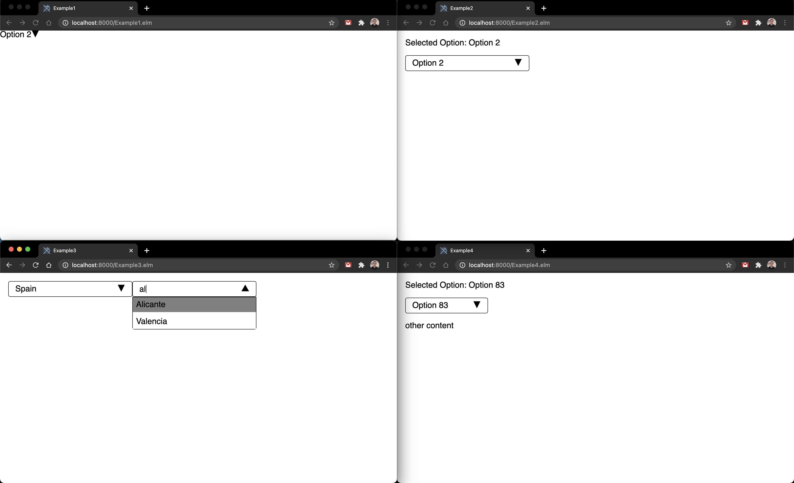

## Elm UI Dropdown component

This is an implementation of a configurable dropdown for use with the Elm UI package.



https://package.elm-lang.org/packages/PaackEng/elm-ui-dropdown/1.1.0/

It tries to follow the advice from

https://github.com/evancz/elm-sortable-table
https://medium.com/elm-shorts/a-reusable-dropdown-in-elm-part-1-d7ac2d106f13

## Examples

See the examples in the `examples/` directory

```
cd examples/
elm reactor
```

go to http://localhost:8000

## License

MIT
